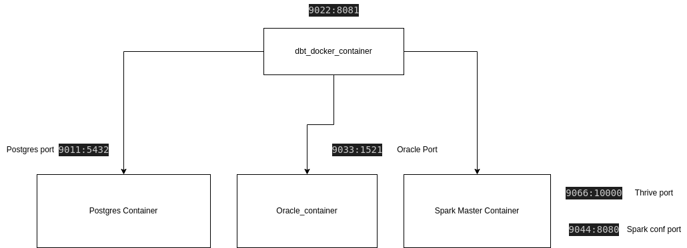
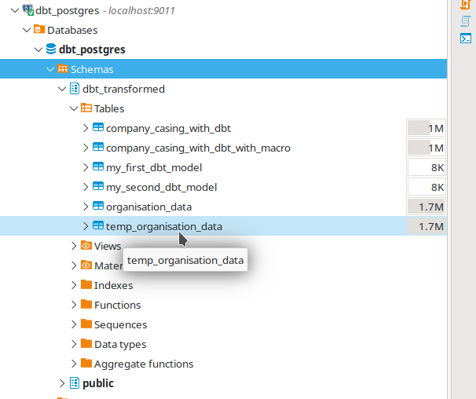
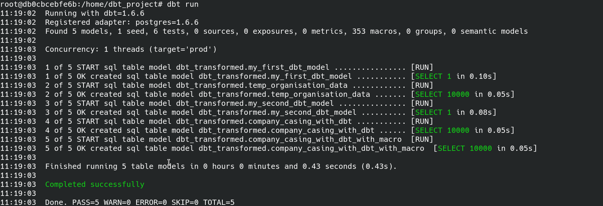
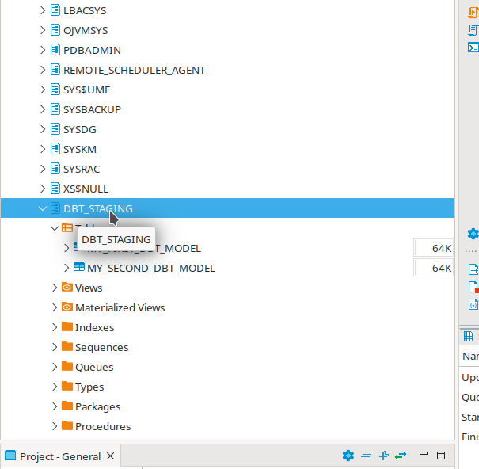
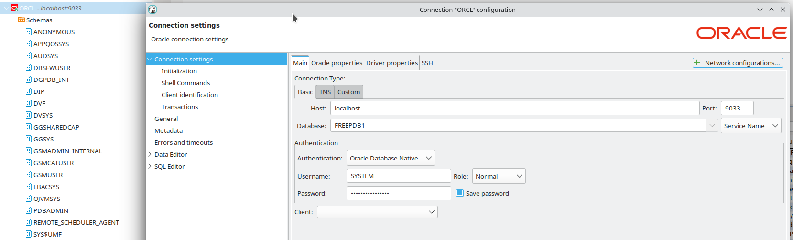
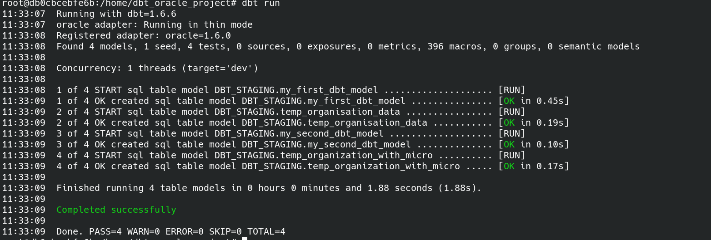
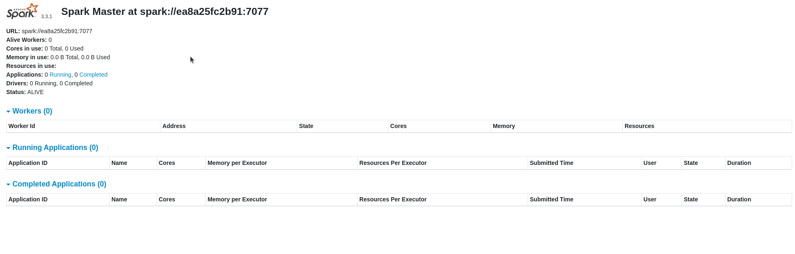
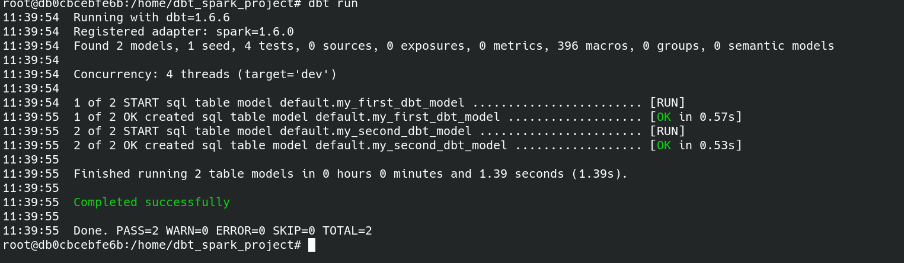
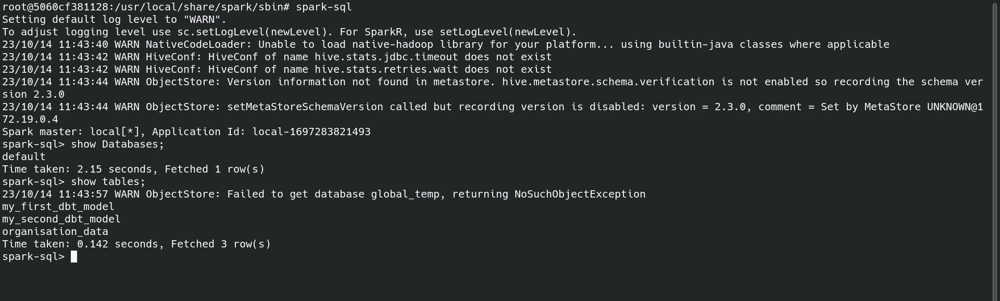
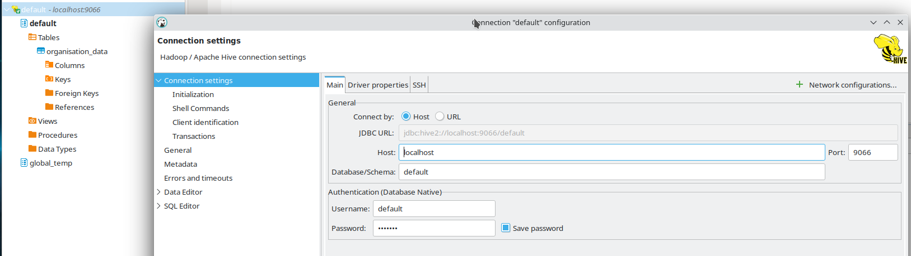

## dbt-containerized-projects
#### Architectural Diagram

### Requirements
docker, docker-compose
### Setup
```bash
docker-compose up
```
### dbt-commands
```bash
dbt compile 
dbt debug
dbt run 
dbt seed 
```
# databases


## Postgres
**Image of postgres DB**




**DBT command for dbt run**



## Oracle
You need to create a Schema DBT_STAGING
and have to run below query to give sufficient permission
```sql
ALTER USER DBT_STAGING quota 100M on USERS;
```
**Image of oracle db**





**DBT command for dbt run**




## Spark Cluster

**Note** In order to run spark cluster these below scripts must be start(these already automated in docker file)

* /usr/local/share/spark/sbin/start-master.sh
* /usr/local/share/spark/sbin/start-thriftserver.sh

Only master node is created 
with below details 
**Image of Master Spark Cluster**



**DBT command for dbt run**



**Image of Cluster Default Database**



